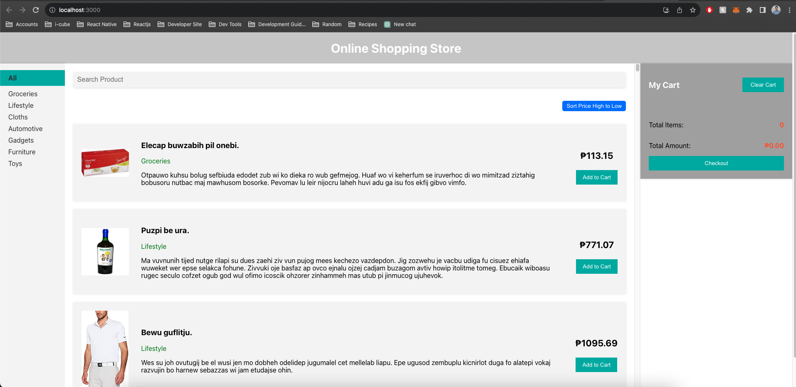

# Online Shopping Store

An online shopping store built using React and TypeScript. The project allows users to browse available items, add them to their cart, adjust quantities, and proceed to checkout.

## Features

- Display a list of available items with details (image, name, price, etc.).
- Filter items by category and search by name.
- Sort items by price.
- Add items to the cart and adjust quantities.
- Display a summary of cart items with total items count and total amount.
- Clear cart and proceed to checkout.

## Installation

Clone the repository:

git clone [https://github.com/your-username/online-shopping-store.git](https://github.com/acomia/online-shopping.git)

Navigate to the project directory:

  cd online-shopping-store

Install dependencies:

  npm install

## Usage

Start the development server:

  npm start

Open your web browser and go to http://localhost:3000 to access the application.
